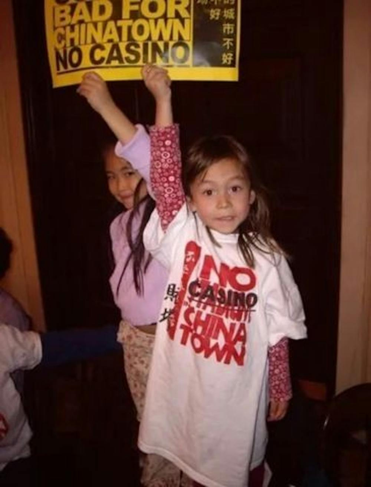

## Taryn's Reflection on the Digital Humanities

I have always gravitated towards the humanities. I’ve been a history major since I applied to college. Born and raised in Philly, I am naturally drawn to local histories rather than broad, high-level histories of nation-states and international relations. I was inspired by oral history interviews I did in high school with students of the <a href="https://whyy.org/articles/philly-students-secure-historical-marker-commemorating-1967-school-walkout-notorious-for-rizzo-brutality/">1967 Black Student Walkouts</a>, a series of student protests that led to the Philadelphia School District mandating African American history as a requirement for graduation. As I continued into college and eventually started writing my senior thesis, I stayed in this discipline and even methodology. In my thesis, I’m writing about the lives of residents and community members of Philadelphia Chinatown in the 1970s to 1990s and their history of resistance against predatory development, conducting oral histories with community members. To me, as a biracial Asian American kid who went to school in Chinatown, this work was not just this abstract history; it was my own. The activists of the 70s-90s were the ones who built the school I went to, the ones who fought for the community I was raised in and protested for. 

I have always gravitated towards the humanities. I’ve been a history major since I applied to college. Born and raised in Philly, I am naturally drawn to local histories rather than broad, high-level histories of nation-states and international relations. I was inspired by oral history interviews I did in high school with students of the <a href="https://whyy.org/articles/philly-students-secure-historical-marker-commemorating-1967-school-walkout-notorious-for-rizzo-brutality/">1967 Black Student Walkouts</a>, a series of student protests that led to the Philadelphia School District mandating African American history as a requirement for graduation. As I continued into college and eventually started writing my senior thesis, I stayed in this discipline and even methodology. In my thesis, I’m writing about the lives of residents and community members of Philadelphia Chinatown in the 1970s to 1990s and their history of resistance against predatory development, conducting oral histories with community members. To me, as a biracial Asian American kid who went to school in Chinatown, this work was not just this abstract history; it was my own. The activists of the 70s-90s were the ones who built the school I went to, the ones who fought for the community I was raised in and protested for. 

Thus, I’ve always seen the humanities’ essence as inherently personal. I am a strong proponent of bottom-up histories, highlighting individuals. History doesn’t happen to people; individuals build the history we know today. I think that is why I was drawn to the editors of The Umpire for my <a href="https://printinginprisons.org/blog/flahertyt/">Printing in Prisons project</a>.
Even though there wasn’t that much information about their lives, the project was all about trying to shape what their lives could’ve been like. I refer to them by their first names because probably very few people knew William Mitchell as “Mitchell” or “Mr. Mitchell.” Their families, spouses, or children probably knew him as William, Will, dad, etc. I liked how in small ways I was able to highlight a piece of each of the editors' histories, but I do regret not being able to have more personal documents other than just their prison logs. I would’ve liked to see if I could track down their parents, their children, or their names in the newspapers, anything really. I think characterizing their families to shed light on their upbringing could’ve enriched my project way more in explaining their mindset or approach to the newspaper. I have a little of this with William Mitchell’s “Prison Papers” article, which clearly showed his opinions on the politics of prison papers. With more time, I think I would’ve researched this moment more to reflect on what experiences made William write that article. However, I’m overall glad that I was able to continue to pursue my interests in bottom-up individual stories which build larger community histories through this course. 

This interest in bottom-up histories is also why I was intrigued by the questions posed in this course in Katie Rawson’s “Against Cleaning” and “The Ethics of Digital Data on Convict Lives.” I think on the ethics of convict histories, the reading gave me good language to describe the colloquial phrase “trauma porn” through its discussion of dark tourism and the oversensationalized and almost fetishization of the “misery of others.” I think I’ve found this particularly compelling because many histories of resistance are dulled down by larger figures or issues, reduced to victimhood, and then most of the content of marginalized individuals is just bathed in victimhood and misery.  It removed agency, humanism, and individualism from people. This tied into Rawson’s discussion of reductiveness as inherent in data cleaning. At the discretion of the creator, entire populations of people, often marginalized folks of color, gender minorities, queerness, non-citizenship, etc. are the ones reduced to victims of the government, of men, of white people, and more. 

However, I thought Rawson’s ideas around nonscalability were some of the most applicable in our course. What do you do when you don’t think you can represent something? Some people shy away from that; our course and the digital humanities taught us to embrace it and think creatively—don’t lose the nuance of relationships because it is hard or daunting. My external workshop at Iffy Bookstore reinforced these teachings to think out of the box. My reflection on Iffy was less about the workshop, and more about the principles of the bookstore as a third space.  In a sense, the bookstore also challenged our course; even though the digital space could facilitate gathering and attempting to replicate physical materials, physical materials and space are essential in understanding the humanities and how to capture the interactions between people.

I thought of the humanities implicitly through a qualitative lens and never put that much intentional thought into quantitative data. It’s probably why I lean so heavily into oral histories, in-person research and documents, and less so into the digital space. I expected the digital humanities to be digital archives (shoutout to <a href="https://welgadigitalarchive.omeka.net/">Welga Archive</a>, <a href="https://ddr.densho.org/">Densho Repository</a>, and <a href="https://www.saada.org/">SAADA</a> which I’ve been inspired by) or projects that resemble what I’ve seen on Storymaps. And even though those are included in the digital humanities, I didn’t think of programs like Social Explorer or the Torn Apart DH project, and other quantitative data-driven projects.  I think an ongoing lesson I’m learning throughout this course is the ties between the humanities, which I associate with qualitative data, and the social sciences, which I associate with quantitative data. Both forms of data require a critical lens and can be used to reinforce each other rather than be put at odds with each other. Digital tools like Social Explorer can be utilized to visualize and present data in a more impactful way, especially for comparative projects. These visual and written modes can combat the historical effects of data cleaning and selection bias and aid in the posterity of very old historical documents. I think much of our work is to contribute to the knowledge of future generations and digitization has a huge role to play in the preservation of knowledge and stories.  

